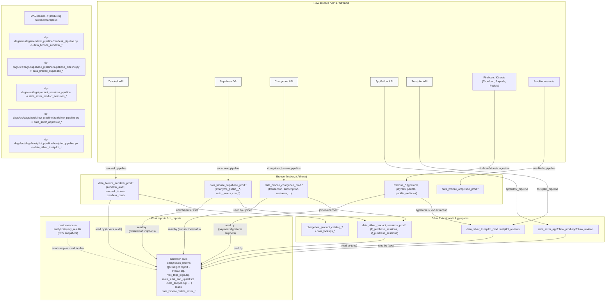

## Data flow (Mermaid)

Ниже — диаграмма Mermaid, показывающая поток данных от raw источников через bronze/silver слои к `cc_reports`.


```

---

Файл сгенерирован автоматически — напиши, если надо экспортировать в PNG/SVG.
